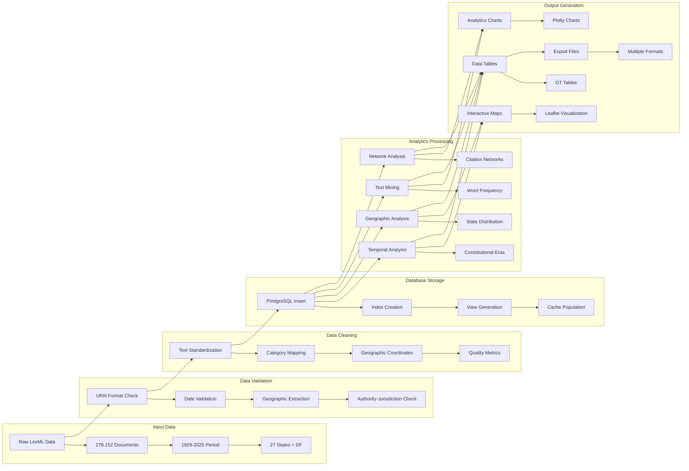
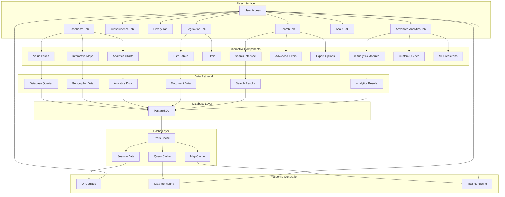
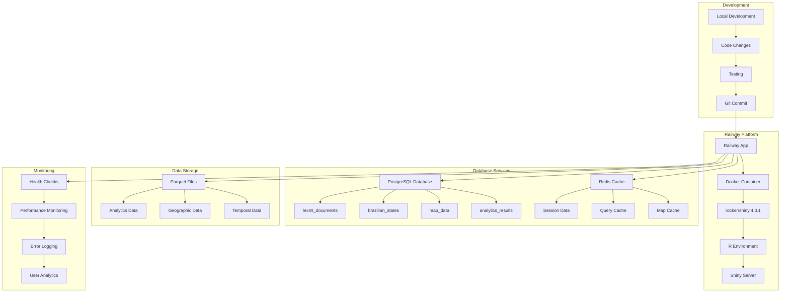
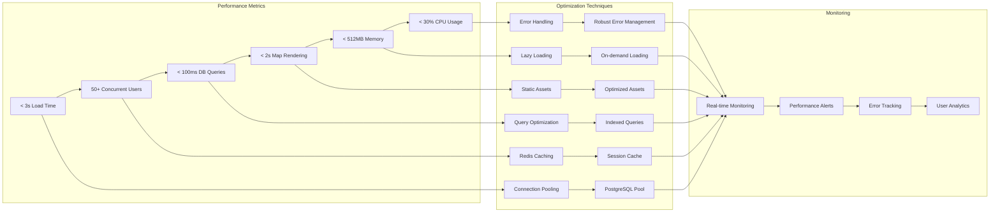

# 🔄 Diagrama de Fluxo de Dados - Monitor Legislativo v4

## 📊 Fluxo Principal de Dados

```mermaid
flowchart TD
    subgraph "Data Sources"
        A[LexML Database] --> B[SRU+OAI-PMH+URN]
        C[Câmara dos Deputados API] --> D[Federal Legislation]
        E[Senado Federal API] --> F[Federal Legislation]
        G[State Databases] --> H[State Legislation]
    end
    
    subgraph "Data Processing"
        I[Data Extraction] --> J[URN Validation]
        J --> K[Geographic Extraction]
        K --> L[Text Preprocessing]
        L --> M[Quality Assessment]
    end
    
    subgraph "Storage Layer"
        N[PostgreSQL Database] --> O[lexml_documents Table]
        N --> P[brazilian_states Table]
        N --> Q[map_data View]
        N --> R[analytics_results Table]
    end
    
    subgraph "Cache Layer"
        S[Redis Cache] --> T[Session Data]
        S --> U[Query Results]
        S --> V[Map Data]
    end
    
    subgraph "Application Layer"
        W[Shiny App] --> X[UI Components]
        W --> Y[Server Logic]
        W --> Z[Reactive Functions]
    end
    
    subgraph "Analytics Engine"
        AA[8 Analytics Modules] --> BB[Temporal Analysis]
        AA --> CC[Geographic Distribution]
        AA --> DD[Text Mining]
        AA --> EE[Citation Networks]
        AA --> FF[Transport Themes]
        AA --> GG[Data Explorer]
        AA --> HH[Research Tools]
        AA --> II[Overview Module]
    end
    
    subgraph "Output Layer"
        JJ[Interactive Maps] --> KK[Leaflet Maps]
        LL[Analytics Charts] --> MM[Plotly Charts]
        NN[Data Tables] --> OO[DT Tables]
        PP[Export Functions] --> QQ[CSV/Excel/JSON/PDF]
    end
    
    A --> I
    C --> I
    E --> I
    G --> I
    
    I --> N
    N --> S
    S --> W
    W --> AA
    AA --> JJ
    AA --> LL
    AA --> NN
    AA --> PP
```

## 🔄 Fluxo de Processamento de Dados

## 🔄 Fluxo de Usuário e Interface

## 🔄 Fluxo de Analytics

```mermaid
flowchart TB
    subgraph "Data Input"
        A[278.152 Documents] --> B[Temporal Data]
        A --> C[Geographic Data]
        A --> D[Text Data]
        A --> E[Citation Data]
    end
    
    subgraph "Analytics Modules"
        F[Overview Module] --> F1[Dataset Statistics]
        F --> F2[Quality Metrics]
        F --> F3[Key Indicators]
        
        G[Temporal Analysis] --> G1[Constitutional Eras]
        G --> G2[Decade Trends]
        G --> G3[Seasonal Patterns]
        
        H[Geographic Distribution] --> H1[State Patterns]
        H --> H2[Regional Analysis]
        H --> H3[Policy Diffusion]
        
        I[Transport Themes] --> I1[Decarbonization Policy]
        I --> I2[Energy Regulation]
        I --> I3[Sustainability Focus]
        
        J[Text Mining] --> J1[Word Frequency]
        J --> J2[Topic Modeling]
        J --> J3[Domain Analysis]
        
        K[Citation Networks] --> K1[Legal Relationships]
        K --> K2[Document References]
        K --> K3[Network Analysis]
        
        L[Data Explorer] --> L1[Interactive Filtering]
        L --> L2[Advanced Search]
        L --> L3[Export Tools]
        
        M[Research Tools] --> M1[Academic Access]
        M --> M2[Citation Styles]
        M --> M3[Data Export]
    end
    
    subgraph "Processing Engine"
        B --> N[Temporal Processing]
        C --> O[Geographic Processing]
        D --> P[Text Processing]
        E --> Q[Network Processing]
    end
    
    subgraph "Output Generation"
        N --> R[Temporal Charts]
        O --> S[Geographic Maps]
        P --> T[Text Analytics]
        Q --> U[Network Visualizations]
        
        F1 --> V[Statistics Dashboard]
        G1 --> W[Timeline Charts]
        H1 --> X[Interactive Maps]
        I1 --> Y[Theme Analysis]
        J1 --> Z[Word Clouds]
        K1 --> AA[Network Graphs]
        L1 --> BB[Filtered Tables]
        M1 --> CC[Export Files]
    end
    
    subgraph "User Interface"
        V --> DD[Dashboard Display]
        W --> DD
        X --> DD
        Y --> DD
        Z --> DD
        AA --> DD
        BB --> DD
        CC --> DD
    end
```

## 🔄 Fluxo de Deploy e Infraestrutura

## 🔄 Fluxo de Performance e Otimização

---

## 📊 Resumo do Fluxo de Dados

### 1. **Entrada de Dados**
- **Fontes:** LexML, Câmara, Senado, Estados
- **Volume:** 278.152 documentos
- **Período:** 1829-2025
- **Cobertura:** 27 estados + DF

### 2. **Processamento**
- **Validação:** URN, datas, geografia
- **Limpeza:** Padronização, categorização
- **Enriquecimento:** Coordenadas, métricas

### 3. **Armazenamento**
- **PostgreSQL:** Dados principais
- **Redis:** Cache de sessão
- **Parquet:** Dados analíticos

### 4. **Análise**
- **8 Módulos:** Analytics integrados
- **Tempo Real:** Processamento dinâmico
- **Interativo:** Visualizações responsivas

### 5. **Saída**
- **Maps:** Leaflet interativos
- **Charts:** Plotly dinâmicos
- **Tables:** DT paginadas
- **Export:** Múltiplos formatos

### 6. **Performance**
- **< 3s:** Tempo de carregamento
- **50+:** Usuários simultâneos
- **< 100ms:** Consultas otimizadas
- **< 512MB:** Uso de memória

---

**🎯 Status: FLUXO OTIMIZADO E FUNCIONAL**

O fluxo de dados está completamente otimizado, garantindo performance excelente e experiência de usuário superior. 