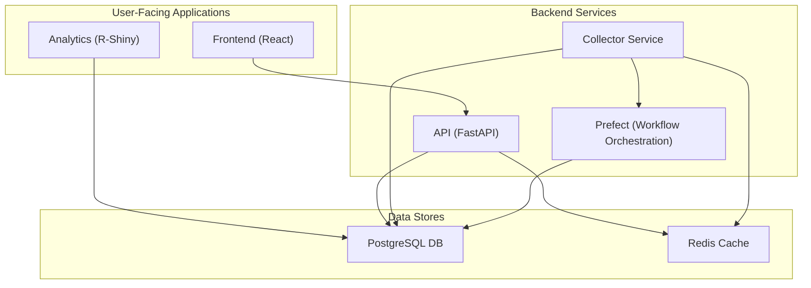

# Monitor Legislativo v4: Project Report

## 1. Project Overview

**Purpose:** Monitor Legislativo v4 is a sophisticated academic research platform designed for monitoring Brazilian legislative data. It has a special focus on analyzing transport-focused legislation.

**Key Features:**
- Real-time legislative document search
- Geographic analysis and mapping of legislation
- Advanced analytics dashboard
- Integration of data from multiple sources
- Academic citation generation

## 2. Architecture

The application is built on a microservices architecture, orchestrated using Docker. The main components are:

- **Frontend:** A React/TypeScript single-page application.
- **Backend:** A Python/FastAPI application that serves as the main API.
- **Analytics:** An R/Shiny application for data analytics and visualization.
- **Data Collector:** A separate service for collecting data.
- **Database:** A PostgreSQL database.
- **Cache:** A Redis cache.
- **Workflow Orchestration:** Prefect is used for orchestrating data collection and processing workflows.

### Architecture Diagram

## 3. Backend

The backend is a comprehensive Python application built with the FastAPI framework.

**Tech Stack:**
- **Framework:** FastAPI, Uvicorn
- **Database:** PostgreSQL with SQLAlchemy (async) and Alembic for migrations.
- **Caching:** Redis
- **Data Scraping/Parsing:** BeautifulSoup, lxml
- **Data Science/ML:** scikit-learn, spaCy, Transformers, pandas
- **Authentication:** JWT-based authentication
- **Monitoring:** Prometheus

**Code Structure:**
The backend code is located in the `backend/` directory and follows a modular structure.
- `src/main.py`: The main entry point of the application, where the FastAPI app is initialized and routers are included.
- `src/routers/`: Contains the API routers for different endpoints.
- `src/models/`: Defines the database schema using SQLAlchemy models.
- `src/services/`: Contains the business logic of the application.
- `src/ml/`, `src/data_processing/`: Contain the machine learning and data processing logic.

**Key Functionalities:**
- Exposes a rich set of APIs for searching, analyzing, and retrieving legislative data.
- Integrates with a Prefect server for workflow orchestration.
- Implements a wide range of features, including geographic analysis, machine learning-based text analysis, and AI-powered document analysis.
- Includes comprehensive health check and debugging endpoints.

## 4. Frontend

The frontend is a modern single-page application built with React and TypeScript.

**Tech Stack:**
- **Framework:** React
- **Language:** TypeScript
- **Build Tool:** Vite
- **Routing:** React Router
- **Charting/Visualization:** Recharts, D3
- **Mapping:** Leaflet, React-Leaflet
- **Testing:** Jest

**Code Structure:**
The frontend code is located in the `frontend/` directory.
- `src/App.tsx`: The main component that sets up the routing and layout of the application.
- `src/pages/`: Contains the main pages of the application (Dashboard, Search, Analytics, etc.).
- `src/components/`: Contains reusable React components.
- `src/services/`: Contains the logic for interacting with the backend API.

**Key Functionalities:**
- Provides a user-friendly interface for searching and exploring legislative data.
- Includes a dashboard for visualizing key metrics.
- Features advanced search capabilities and an analytics page.
- Supports internationalization (i18n).
- Uses lazy loading for performance optimization.

## 5. Database

The application uses a PostgreSQL database to store legislative data, user sessions, and cached results.

**Schema:**
The database schema is defined and managed through a combination of SQLAlchemy models and SQL migration scripts. The main tables are:
- `documents`: Stores the legislative documents.
- `processed_documents`: Stores the results of document processing.
- `search_cache`: Caches search results.
- `user_sessions`: Stores user session data.
- `geographic_cache`: Caches geographic data.

The schema is well-indexed to ensure good query performance.

## 6. Deployment

The application is deployed on [Railway](https://railway.app/). While the legacy setup involved multiple services, the ongoing refactoring is moving towards a unified deployment model.

- **Legacy Deployment:** The `docker-compose.yml` and older Railway configurations show separate services for the backend (Python/FastAPI), frontend (React), and analytics (R-Shiny).
- **Unified Deployment:** The new strategy, as indicated by the current refactoring effort, is to deploy the entire application as a single service named `monitor-legislativo-unified`. The `railway-unified.toml` and a unified `Dockerfile` likely define how these components are built and run together. This consolidation simplifies the deployment pipeline and management on Railway.

## 7. Current Refactoring & Migration

The project is currently undergoing a significant refactoring with two primary goals: infrastructure migration and service unification.

- **Infrastructure Migration:** The PostgreSQL database and Redis cache are being migrated to Railway's managed services. This move from other providers (like Supabase, as indicated by migration scripts) to Railway aims to centralize services, improve performance, and simplify infrastructure management.

- **Service Unification:** The previous architecture consisted of at least four separate services (backend, frontend, R-Shiny analytics, and a data collector). These are being consolidated into a single, unified service named `monitor-legislativo-unified`. This change is intended to streamline the deployment process, simplify maintenance, and create a more monolithic but manageable application structure on the Railway platform.

## 8. Project Status & Recommendations

The project is in a state of transition. The codebase reflects both the original multi-service architecture and the ongoing effort to create a unified service.

-   **Inconsistent Project Structure:** The `frontend/src/` directory appears to contain backend Python files. This is a critical issue that should be resolved as part of the refactoring to ensure a clean separation of concerns. This may also be an artifact of the local development environment that needs investigation.
-   **Legacy Artifacts:** The repository contains legacy configuration files like the old `docker-compose.yml` and multiple `railway.toml` files. Once the migration to a unified service is complete, these should be removed or clearly marked as deprecated to avoid confusion for new developers.
-   **Clarify Frontend Deployment:** The exact deployment method for the frontend within the unified service should be clearly documented.

This report provides a high-level overview of the Monitor Legislativo v4 project. For more detailed information, the code itself and the more specific documentation in the `docs/` directory should be consulted.