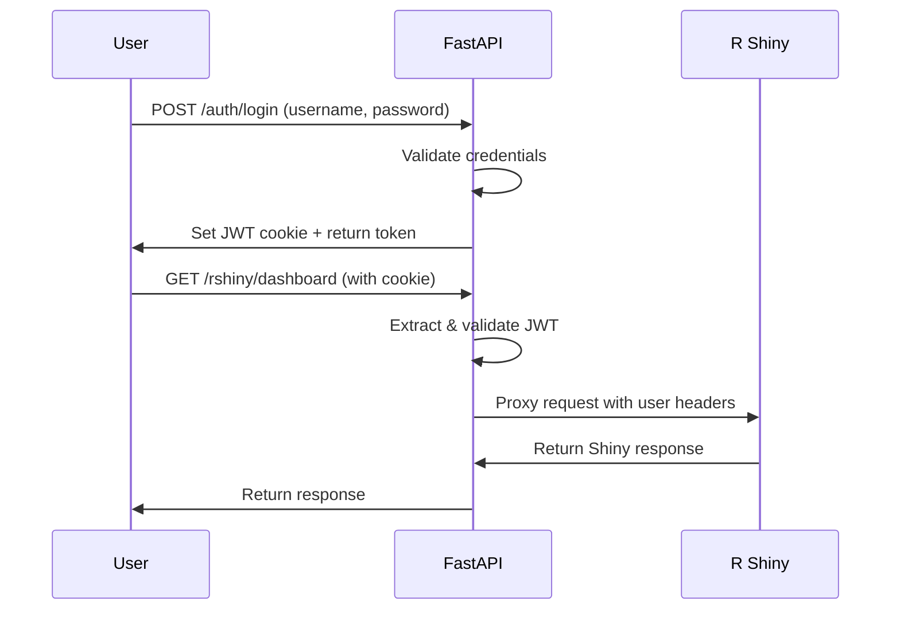

# R Shiny × FastAPI Single Sign-On Integration

This document describes how to integrate R Shiny applications with the Monitor Legislativo FastAPI backend for unified authentication.

## Overview

The SSO system works by:
1. Users authenticate via FastAPI `/auth/login` endpoint
2. FastAPI sets secure HttpOnly JWT cookies
3. Requests to R Shiny are proxied through FastAPI at `/rshiny/*`
4. FastAPI extracts JWT from cookies and forwards user info to R Shiny via headers
5. R Shiny apps can access user information and implement role-based features

## Authentication Flow



## FastAPI Endpoints

### Authentication

- `POST /auth/login` - Login with username/password, sets JWT cookie
- `POST /auth/logout` - Clear JWT cookies
- `POST /auth/refresh` - Refresh access token using refresh token
- `GET /auth/me` - Get current user info
- `GET /auth/verify` - Verify token (for R Shiny)

### Proxy

- `GET /rshiny/{path}` - Proxy all requests to R Shiny with auth headers

## Headers Sent to R Shiny

When proxying requests, FastAPI adds these headers:

```
X-User-Id: user123
X-Username: john.doe
X-User-Roles: admin,user
X-User-Permissions: read,write,admin
Authorization: Bearer <jwt-token>
```

For anonymous users:
```
X-User-Id: anonymous
X-Username: anonymous
X-User-Roles: guest
X-User-Permissions: read
```

## R Shiny Integration

### Reading User Information

```r
# In your Shiny server function
server <- function(input, output, session) {
  # Get user info from headers
  user_id <- parseHTTPHeaderValue(session$request$HTTP_X_USER_ID)
  username <- parseHTTPHeaderValue(session$request$HTTP_X_USERNAME)
  roles <- strsplit(parseHTTPHeaderValue(session$request$HTTP_X_USER_ROLES), ",")[[1]]
  permissions <- strsplit(parseHTTPHeaderValue(session$request$HTTP_X_USER_PERMISSIONS), ",")[[1]]
  
  # Display user info
  output$welcome <- renderText({
    paste("Welcome,", username, "! Your roles:", paste(roles, collapse=", "))
  })
  
  # Role-based UI
  output$admin_panel <- renderUI({
    if ("admin" %in% roles) {
      tagList(
        h3("Admin Panel"),
        actionButton("admin_action", "Admin Action")
      )
    } else {
      p("Admin access required")
    }
  })
}
```

### JWT Validation (Optional)

If you want to validate the JWT token in R:

```r
# Install: install.packages(c("jose", "jsonlite"))
library(jose)
library(jsonlite)

validate_jwt <- function(session) {
  auth_header <- session$request$HTTP_AUTHORIZATION
  if (is.null(auth_header) || !startsWith(auth_header, "Bearer ")) {
    return(NULL)
  }
  
  token <- substring(auth_header, 8)  # Remove "Bearer "
  secret <- Sys.getenv("JWT_SECRET", "your-secret-key-change-in-production")
  
  tryCatch({
    payload <- jwt_decode_hmac(token, secret)
    return(payload)
  }, error = function(e) {
    warning("JWT validation failed:", e$message)
    return(NULL)
  })
}

# Usage in server function
server <- function(input, output, session) {
  user_data <- validate_jwt(session)
  
  if (is.null(user_data)) {
    # Handle unauthenticated user
    output$message <- renderText("Please log in")
  } else {
    # Authenticated user
    output$message <- renderText(paste("Hello,", user_data$username))
  }
}
```

## Environment Variables

Set these in your R Shiny app environment:

```bash
# JWT secret (must match FastAPI)
JWT_SECRET=your-secret-key-change-in-production

# Optional: FastAPI URL for direct API calls
FASTAPI_URL=https://your-fastapi-app.railway.app
```

## Demo Users

For testing, the system includes demo users:

| Username | Password | Roles | Permissions |
|----------|----------|--------|-------------|
| admin | admin123 | admin, user | read, write, admin |
| user | user123 | user | read |

## Frontend Integration

### Login Form Example

```javascript
// Login function
async function login(username, password) {
  const response = await fetch('/auth/login', {
    method: 'POST',
    headers: {
      'Content-Type': 'application/json'
    },
    body: JSON.stringify({ username, password }),
    credentials: 'include'  // Include cookies
  });
  
  if (response.ok) {
    const data = await response.json();
    console.log('Login successful:', data);
    // Redirect to R Shiny app
    window.location.href = '/rshiny/dashboard';
  } else {
    console.error('Login failed');
  }
}

// Check authentication status
async function checkAuth() {
  const response = await fetch('/auth/me', {
    credentials: 'include'
  });
  
  if (response.ok) {
    const user = await response.json();
    return user;
  } else {
    return null;
  }
}

// Logout function
async function logout() {
  await fetch('/auth/logout', {
    method: 'POST',
    credentials: 'include'
  });
  window.location.href = '/login';
}
```

## Security Considerations

1. **JWT Secret**: Use a strong, random secret key in production
2. **HTTPS**: Always use HTTPS in production for secure cookie transmission
3. **Cookie Settings**: 
   - `httponly=True` prevents XSS attacks
   - `secure=True` requires HTTPS
   - `samesite='none'` allows cross-site requests (adjust as needed)
4. **Token Expiration**: Tokens expire after 60 minutes by default
5. **Refresh Tokens**: Available for maintaining sessions

## Deployment Configuration

### Railway Environment Variables

Set these in your Railway app:

```bash
# Required
JWT_SECRET=your-very-secure-secret-key-here
RSHINY_URL=https://your-rshiny-app.railway.app

# Optional
JWT_ACCESS_TOKEN_EXPIRE_MINUTES=60
JWT_REFRESH_TOKEN_EXPIRE_DAYS=7
```

### Production Checklist

- [ ] Set strong JWT_SECRET
- [ ] Configure CORS origins appropriately
- [ ] Enable HTTPS
- [ ] Set up proper user database (replace demo users)
- [ ] Implement password hashing
- [ ] Set up proper role/permission management
- [ ] Configure session management
- [ ] Set up monitoring for auth failures

## Troubleshooting

### Common Issues

1. **401 Unauthorized**: Check JWT secret matches between FastAPI and R Shiny
2. **CORS Errors**: Verify origins are configured correctly
3. **Cookie Not Set**: Ensure `credentials: 'include'` in frontend requests
4. **Headers Missing in R**: Check proxy is working correctly

### Debug Endpoints

- `GET /auth/verify` - Check if token is valid
- `GET /rshiny/health` - Test R Shiny connectivity
- `GET /ready` - Check overall system health

### Logging

Enable debug logging to troubleshoot auth issues:

```python
# In FastAPI
import logging
logging.getLogger("src.routers.auth_router").setLevel(logging.DEBUG)
logging.getLogger("src.routers.rshiny_proxy_router").setLevel(logging.DEBUG)
```

```r
# In R Shiny
options(shiny.trace = TRUE)
```