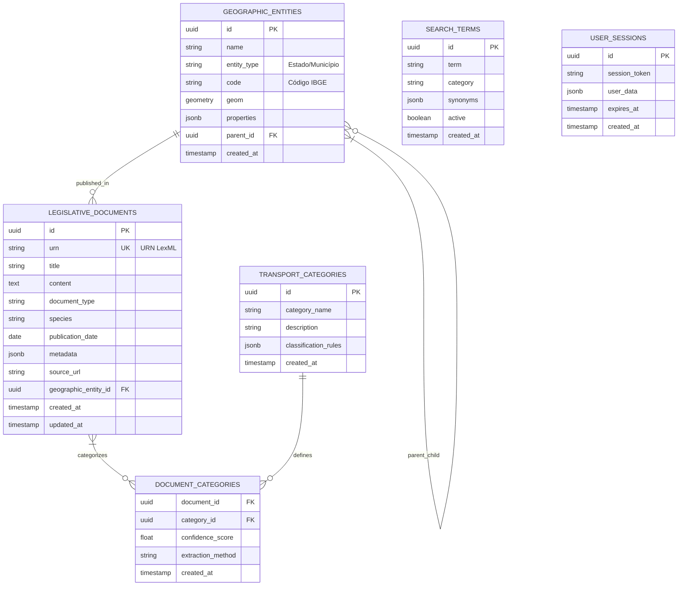

# Esquema do Banco de Dados - Monitor Legislativo v4

**Público-alvo**: Desenvolvedores Full-Stack, DBAs, Analistas de Dados  
**Última atualização**: 8 de agosto de 2025  
**Versão**: 1.0  
**Status**: Em Desenvolvimento

## Resumo Executivo

Documentação completa do esquema PostgreSQL do Monitor Legislativo v4, incluindo estruturas de tabelas, relacionamentos, índices e estratégias de otimização para dados legislativos brasileiros.

## Visão Geral do Banco de Dados

### Informações Gerais
- **SGBD**: PostgreSQL 15+
- **Extensões**: PostGIS (geoespacial), pg_trgm (busca textual)
- **Encoding**: UTF-8
- **Collation**: pt_BR.UTF-8
- **Tamanho Estimado**: 50GB+ (dados completos)

### Esquemas Principais

```sql
-- Esquemas organizacionais
CREATE SCHEMA IF NOT EXISTS public;          -- Tabelas principais
CREATE SCHEMA IF NOT EXISTS analytics;       -- Views e tabelas analíticas
CREATE SCHEMA IF NOT EXISTS cache;           -- Tabelas de cache
CREATE SCHEMA IF NOT EXISTS audit;           -- Logs e auditoria
```

## Modelo Entidade-Relacionamento



## Estrutura Detalhada das Tabelas

### 1. LEGISLATIVE_DOCUMENTS
**Função**: Armazenamento principal dos documentos legislativos

```sql
CREATE TABLE public.legislative_documents (
    id UUID PRIMARY KEY DEFAULT gen_random_uuid(),
    urn VARCHAR(500) UNIQUE NOT NULL,
    title TEXT NOT NULL,
    content TEXT,
    document_type VARCHAR(100),
    species VARCHAR(100),
    publication_date DATE,
    publication_year INTEGER GENERATED ALWAYS AS (EXTRACT(YEAR FROM publication_date)) STORED,
    source_url TEXT,
    geographic_entity_id UUID REFERENCES geographic_entities(id),
    metadata JSONB,
    full_text_search TSVECTOR GENERATED ALWAYS AS (
        to_tsvector('portuguese', COALESCE(title, '') || ' ' || COALESCE(content, ''))
    ) STORED,
    created_at TIMESTAMP WITH TIME ZONE DEFAULT NOW(),
    updated_at TIMESTAMP WITH TIME ZONE DEFAULT NOW()
);

-- Índices para performance
CREATE INDEX idx_legislative_documents_urn ON legislative_documents USING btree(urn);
CREATE INDEX idx_legislative_documents_type ON legislative_documents USING btree(document_type);
CREATE INDEX idx_legislative_documents_date ON legislative_documents USING btree(publication_date);
CREATE INDEX idx_legislative_documents_year ON legislative_documents USING btree(publication_year);
CREATE INDEX idx_legislative_documents_fts ON legislative_documents USING gin(full_text_search);
CREATE INDEX idx_legislative_documents_metadata ON legislative_documents USING gin(metadata);
CREATE INDEX idx_legislative_documents_geographic ON legislative_documents(geographic_entity_id);

-- Trigger para atualização automática
CREATE OR REPLACE FUNCTION update_modified_column()
RETURNS TRIGGER AS $$
BEGIN
    NEW.updated_at = NOW();
    RETURN NEW;
END;
$$ language 'plpgsql';

CREATE TRIGGER update_legislative_documents_modtime 
    BEFORE UPDATE ON legislative_documents 
    FOR EACH ROW EXECUTE FUNCTION update_modified_column();
```

### 2. GEOGRAPHIC_ENTITIES
**Função**: Entidades geográficas (estados, municípios)

```sql
CREATE TABLE public.geographic_entities (
    id UUID PRIMARY KEY DEFAULT gen_random_uuid(),
    name VARCHAR(255) NOT NULL,
    entity_type VARCHAR(50) NOT NULL CHECK (entity_type IN ('pais', 'estado', 'municipio', 'distrito')),
    code VARCHAR(20), -- Código IBGE
    geom GEOMETRY(MULTIPOLYGON, 4326), -- Geometria em EPSG:4326 (WGS84)
    properties JSONB,
    parent_id UUID REFERENCES geographic_entities(id),
    created_at TIMESTAMP WITH TIME ZONE DEFAULT NOW()
);

-- Índices geoespaciais
CREATE INDEX idx_geographic_entities_geom ON geographic_entities USING gist(geom);
CREATE INDEX idx_geographic_entities_type ON geographic_entities(entity_type);
CREATE INDEX idx_geographic_entities_code ON geographic_entities(code);
CREATE INDEX idx_geographic_entities_parent ON geographic_entities(parent_id);
CREATE INDEX idx_geographic_entities_name ON geographic_entities USING gin(to_tsvector('portuguese', name));
```

### 3. TRANSPORT_CATEGORIES
**Função**: Categorias de transporte para classificação

```sql
CREATE TABLE public.transport_categories (
    id UUID PRIMARY KEY DEFAULT gen_random_uuid(),
    category_name VARCHAR(255) UNIQUE NOT NULL,
    description TEXT,
    keywords TEXT[], -- Array de palavras-chave
    classification_rules JSONB,
    parent_category_id UUID REFERENCES transport_categories(id),
    active BOOLEAN DEFAULT true,
    created_at TIMESTAMP WITH TIME ZONE DEFAULT NOW(),
    updated_at TIMESTAMP WITH TIME ZONE DEFAULT NOW()
);

-- Índices para classificação
CREATE INDEX idx_transport_categories_keywords ON transport_categories USING gin(keywords);
CREATE INDEX idx_transport_categories_rules ON transport_categories USING gin(classification_rules);
CREATE INDEX idx_transport_categories_parent ON transport_categories(parent_category_id);
```

### 4. DOCUMENT_CATEGORIES (Tabela de Relacionamento)
**Função**: Relacionamento N:N entre documentos e categorias

```sql
CREATE TABLE public.document_categories (
    document_id UUID REFERENCES legislative_documents(id) ON DELETE CASCADE,
    category_id UUID REFERENCES transport_categories(id) ON DELETE CASCADE,
    confidence_score FLOAT CHECK (confidence_score >= 0 AND confidence_score <= 1),
    extraction_method VARCHAR(50), -- 'keyword', 'ml', 'manual'
    metadata JSONB,
    created_at TIMESTAMP WITH TIME ZONE DEFAULT NOW(),
    PRIMARY KEY (document_id, category_id)
);

CREATE INDEX idx_document_categories_confidence ON document_categories(confidence_score);
CREATE INDEX idx_document_categories_method ON document_categories(extraction_method);
```

### 5. SEARCH_TERMS
**Função**: Termos de busca otimizados para o domínio

```sql
CREATE TABLE public.search_terms (
    id UUID PRIMARY KEY DEFAULT gen_random_uuid(),
    term VARCHAR(255) NOT NULL,
    category VARCHAR(100),
    synonyms TEXT[],
    search_frequency INTEGER DEFAULT 0,
    active BOOLEAN DEFAULT true,
    created_at TIMESTAMP WITH TIME ZONE DEFAULT NOW()
);

CREATE INDEX idx_search_terms_category ON search_terms(category);
CREATE INDEX idx_search_terms_active ON search_terms(active);
CREATE INDEX idx_search_terms_frequency ON search_terms(search_frequency DESC);
```

## Views Analíticas

### 1. Document Statistics View
```sql
CREATE VIEW analytics.document_statistics AS
SELECT 
    publication_year,
    document_type,
    COUNT(*) as document_count,
    COUNT(DISTINCT geographic_entity_id) as unique_locations
FROM legislative_documents 
WHERE publication_date IS NOT NULL
GROUP BY publication_year, document_type
ORDER BY publication_year DESC, document_count DESC;
```

### 2. Geographic Distribution View
```sql
CREATE VIEW analytics.geographic_distribution AS
SELECT 
    ge.name as location_name,
    ge.entity_type,
    ge.code as ibge_code,
    COUNT(ld.*) as document_count,
    COUNT(DISTINCT ld.document_type) as document_types
FROM geographic_entities ge
LEFT JOIN legislative_documents ld ON ge.id = ld.geographic_entity_id
GROUP BY ge.id, ge.name, ge.entity_type, ge.code
ORDER BY document_count DESC;
```

### 3. Transport Categories Summary
```sql
CREATE VIEW analytics.transport_categories_summary AS
SELECT 
    tc.category_name,
    COUNT(dc.document_id) as document_count,
    AVG(dc.confidence_score) as avg_confidence,
    COUNT(CASE WHEN dc.extraction_method = 'ml' THEN 1 END) as ml_classified,
    COUNT(CASE WHEN dc.extraction_method = 'manual' THEN 1 END) as manual_classified
FROM transport_categories tc
LEFT JOIN document_categories dc ON tc.id = dc.category_id
GROUP BY tc.id, tc.category_name
ORDER BY document_count DESC;
```

## Estratégias de Performance

### 1. Indexação Estratégica
```sql
-- Índices compostos para consultas frequentes
CREATE INDEX idx_docs_type_date ON legislative_documents(document_type, publication_date);
CREATE INDEX idx_docs_location_type ON legislative_documents(geographic_entity_id, document_type);

-- Índices parciais para dados ativos
CREATE INDEX idx_active_categories ON transport_categories(category_name) WHERE active = true;
CREATE INDEX idx_recent_documents ON legislative_documents(created_at) 
    WHERE created_at >= NOW() - INTERVAL '1 year';
```

### 2. Particionamento
```sql
-- Particionamento por ano para documentos (exemplo futuro)
-- CREATE TABLE legislative_documents_y2024 PARTITION OF legislative_documents 
-- FOR VALUES FROM ('2024-01-01') TO ('2025-01-01');
```

### 3. Configurações de Performance
```sql
-- Configurações específicas para busca textual
ALTER DATABASE monitor_legislativo_v4 SET default_text_search_config = 'portuguese';

-- Configurações de performance para queries analíticas
SET work_mem = '256MB';
SET shared_buffers = '1GB';
SET effective_cache_size = '4GB';
```

## Backup e Recovery

### Estratégia de Backup
```sql
-- Backup completo diário
pg_dump -Fc -f backup_$(date +%Y%m%d).dump monitor_legislativo_v4

-- Backup incremental usando WAL
-- Configuração postgresql.conf:
-- wal_level = replica
-- archive_mode = on
-- archive_command = 'cp %p /backup/wal/%f'
```

### Point-in-Time Recovery
```sql
-- Restore até ponto específico no tempo
pg_restore -d monitor_legislativo_v4 backup_20250808.dump
```

## Migração e Versionamento

### Sistema de Migração
```sql
-- Tabela de controle de migrações
CREATE TABLE IF NOT EXISTS schema_migrations (
    version VARCHAR(255) PRIMARY KEY,
    applied_at TIMESTAMP WITH TIME ZONE DEFAULT NOW()
);

-- Exemplo de migração
-- 001_initial_schema.sql
-- 002_add_fulltext_search.sql
-- 003_add_geographic_indexes.sql
```

### Versionamento de Schema
- **v1.0**: Schema inicial com tabelas básicas
- **v1.1**: Adição de busca textual completa
- **v1.2**: Implementação de índices geoespaciais
- **v2.0**: Particionamento por ano (planejado)

## Conformidade e Auditoria

### LGPD Compliance
```sql
-- Tabela de auditoria para conformidade LGPD
CREATE TABLE audit.data_access_log (
    id UUID PRIMARY KEY DEFAULT gen_random_uuid(),
    user_identifier VARCHAR(255),
    accessed_table VARCHAR(100),
    access_type VARCHAR(20), -- SELECT, INSERT, UPDATE, DELETE
    record_count INTEGER,
    access_timestamp TIMESTAMP WITH TIME ZONE DEFAULT NOW(),
    purpose TEXT
);
```

### Data Retention Policy
```sql
-- Política de retenção de logs (exemplo)
DELETE FROM audit.data_access_log 
WHERE access_timestamp < NOW() - INTERVAL '2 years';
```

## Monitoramento de Performance

### Queries Essenciais para Monitoramento
```sql
-- Slow queries
SELECT query, mean_time, calls, total_time
FROM pg_stat_statements 
ORDER BY mean_time DESC LIMIT 10;

-- Tamanho das tabelas
SELECT 
    schemaname,
    tablename,
    pg_size_pretty(pg_total_relation_size(schemaname||'.'||tablename)) as size
FROM pg_tables 
ORDER BY pg_total_relation_size(schemaname||'.'||tablename) DESC;

-- Índices não utilizados
SELECT 
    schemaname,
    tablename,
    indexname,
    idx_scan
FROM pg_stat_user_indexes 
WHERE idx_scan = 0;
```

## Próximos Desenvolvimentos

### Melhorias Planejadas
1. **Machine Learning Integration**: Tabelas para modelos ML
2. **Real-time Analytics**: Views materializadas
3. **Data Lakehouse**: Integração com Apache Iceberg
4. **Advanced Search**: Implementação de ElasticSearch

### Expansões Futuras
- **Multi-tenancy**: Suporte a múltiplas instituições
- **Temporal Tables**: Histórico completo de mudanças
- **Data Lineage**: Rastreamento de origem dos dados
- **Advanced Partitioning**: Particionamento por região/tipo

## Referências

### Documentação Relacionada
- [System Overview](system-overview.md)
- [R Modules Reference](r-modules-reference.md)
- [Database Configuration Guide](../guides/database-configuration-guide.md)

### Padrões e Normas
- ABNT NBR ISO/IEC 27001:2013 (Segurança da Informação)
- Lei Geral de Proteção de Dados (LGPD)
- PostgreSQL Best Practices
- PostGIS Spatial Standards

---

**Responsável pela Documentação**: Equipe de Banco de Dados  
**Última Revisão Técnica**: Pendente  
**Aprovação DBA**: Pendente  
**Próxima Atualização**: 15 de agosto de 2025