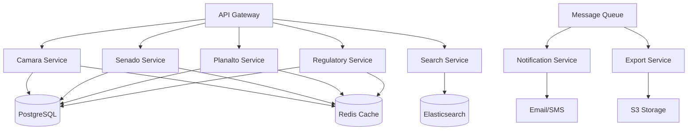

# Microservices Architecture Design
## Legislative Monitoring System V4

### Executive Summary
This document outlines the microservices architecture design for horizontally scaling the Legislative Monitoring System. The design focuses on decomposing the monolithic application into discrete, scalable services while maintaining system reliability and performance.

---

## Current Architecture Analysis

### Monolithic Components
- **API Gateway**: Single entry point for all requests
- **Legislative Services**: Camara, Senado, Planalto APIs integrated
- **Regulatory Services**: ANATEL, ANEEL, ANVISA integrations
- **Shared Utilities**: Caching, monitoring, alerting
- **Web/Desktop Frontends**: Direct coupling to backend

### Identified Bottlenecks
1. Single point of failure in API gateway
2. Resource contention between different API integrations
3. Shared cache causing performance degradation
4. Inability to scale individual components

---

## Proposed Microservices Architecture

### Service Decomposition

```yaml
services:
  # Core Services
  api-gateway:
    description: "Central API gateway with routing and authentication"
    technology: "Kong/Nginx"
    instances: 2-10
    responsibilities:
      - Request routing
      - Authentication/Authorization
      - Rate limiting
      - API versioning
    
  # Legislative Services
  camara-service:
    description: "Handles all Camara API integrations"
    technology: "Python/FastAPI"
    instances: 2-5
    database: "PostgreSQL"
    cache: "Redis"
    queue: "RabbitMQ"
    
  senado-service:
    description: "Handles all Senado API integrations"
    technology: "Python/FastAPI"
    instances: 2-5
    database: "PostgreSQL"
    cache: "Redis"
    queue: "RabbitMQ"
    
  planalto-service:
    description: "Handles all Planalto API integrations"
    technology: "Python/FastAPI"
    instances: 2-5
    database: "PostgreSQL"
    cache: "Redis"
    queue: "RabbitMQ"
    
  # Regulatory Services
  regulatory-service:
    description: "Handles ANATEL, ANEEL, ANVISA APIs"
    technology: "Python/FastAPI"
    instances: 2-5
    database: "PostgreSQL"
    cache: "Redis"
    
  # Support Services
  search-service:
    description: "Unified search across all data sources"
    technology: "Python/Elasticsearch"
    instances: 2-3
    database: "Elasticsearch"
    
  notification-service:
    description: "Handles alerts and notifications"
    technology: "Python/Celery"
    instances: 2-3
    queue: "RabbitMQ"
    
  export-service:
    description: "Handles data exports and reports"
    technology: "Python/Celery"
    instances: 1-3
    storage: "S3/MinIO"
```

### Data Architecture



### Service Communication

#### Synchronous Communication
- **Protocol**: REST/HTTP
- **Format**: JSON
- **Authentication**: JWT tokens
- **Timeout**: 30 seconds
- **Circuit Breaker**: Enabled

#### Asynchronous Communication
- **Message Broker**: RabbitMQ/Kafka
- **Pattern**: Publish/Subscribe
- **Format**: Protocol Buffers
- **Retry Policy**: Exponential backoff

### Database Strategy

#### Service Databases
```sql
-- Each service owns its schema
CREATE SCHEMA camara_service;
CREATE SCHEMA senado_service;
CREATE SCHEMA planalto_service;
CREATE SCHEMA regulatory_service;

-- Shared read-only views for cross-service queries
CREATE VIEW public.legislative_items AS
SELECT * FROM camara_service.proposicoes
UNION ALL
SELECT * FROM senado_service.materias
UNION ALL
SELECT * FROM planalto_service.normas;
```

#### Data Consistency
- **Pattern**: Eventual consistency
- **Events**: Domain events via message queue
- **Saga Pattern**: For distributed transactions

### Caching Strategy

```yaml
cache_layers:
  edge_cache:
    technology: "CloudFront/Varnish"
    ttl: 300
    
  api_cache:
    technology: "Redis Cluster"
    ttl: 3600
    invalidation: "Tag-based"
    
  service_cache:
    technology: "Redis"
    ttl: 7200
    pattern: "Cache-aside"
```

### Security Architecture

```yaml
security:
  authentication:
    type: "OAuth2/JWT"
    provider: "Keycloak"
    token_ttl: 3600
    
  service_mesh:
    technology: "Istio"
    features:
      - mTLS between services
      - Service authorization policies
      - Traffic encryption
      
  secrets_management:
    technology: "HashiCorp Vault"
    features:
      - Dynamic secrets
      - Encryption as a service
      - PKI management
```

### Monitoring and Observability

```yaml
observability:
  metrics:
    technology: "Prometheus + Grafana"
    exporters:
      - Node exporter
      - Python app metrics
      - Custom business metrics
      
  logging:
    technology: "ELK Stack"
    format: "JSON structured logs"
    retention: 30_days
    
  tracing:
    technology: "Jaeger"
    sampling_rate: 0.1
    
  health_checks:
    endpoint: "/health"
    checks:
      - Database connectivity
      - Cache availability
      - External API status
```

### Deployment Architecture

```yaml
kubernetes:
  namespaces:
    - legislative-prod
    - legislative-staging
    - legislative-dev
    
  resources:
    api-gateway:
      replicas: 3
      cpu: "500m"
      memory: "512Mi"
      autoscaling:
        min: 2
        max: 10
        cpu_threshold: 70
        
    legislative-services:
      replicas: 2
      cpu: "1000m"
      memory: "1Gi"
      autoscaling:
        min: 2
        max: 5
        cpu_threshold: 80
```

### Migration Strategy

#### Phase 1: Strangler Fig Pattern
1. Deploy API Gateway
2. Route traffic through gateway
3. Monitor and optimize

#### Phase 2: Service Extraction
1. Extract Camara service
2. Extract Senado service
3. Extract Planalto service
4. Extract Regulatory service

#### Phase 3: Data Migration
1. Set up service databases
2. Implement data sync
3. Switch to service databases
4. Decommission shared database

#### Phase 4: Advanced Features
1. Implement service mesh
2. Add distributed tracing
3. Enhance monitoring
4. Optimize caching

### Performance Targets

| Metric | Current | Target |
|--------|---------|--------|
| API Response Time (p95) | 500ms | 100ms |
| Throughput | 100 req/s | 1000 req/s |
| Availability | 95% | 99.9% |
| Deployment Time | 2 hours | 15 minutes |
| Scale-out Time | Manual | <30 seconds |

### Cost Estimation

#### Infrastructure Costs (Monthly)
- **Kubernetes Cluster**: $500
- **Database (RDS)**: $300
- **Cache (ElastiCache)**: $200
- **Message Queue**: $100
- **Monitoring**: $150
- **Storage**: $50
- **Total**: ~$1,300/month

### Risk Mitigation

1. **Data Consistency**: Implement saga pattern
2. **Service Discovery**: Use Kubernetes DNS
3. **Network Latency**: Deploy in same region
4. **Cascading Failures**: Circuit breakers
5. **Data Loss**: Event sourcing backup

### Success Metrics

- Service uptime >99.9%
- Auto-scaling response <30s
- Zero-downtime deployments
- 50% reduction in MTTR
- 10x improvement in throughput

### Next Steps

1. Set up Kubernetes cluster
2. Create service templates
3. Implement API gateway
4. Extract first service (Camara)
5. Validate architecture with load tests