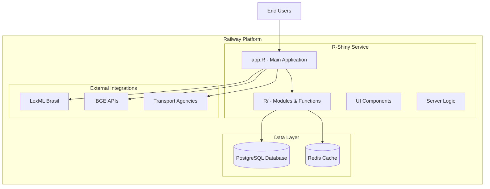
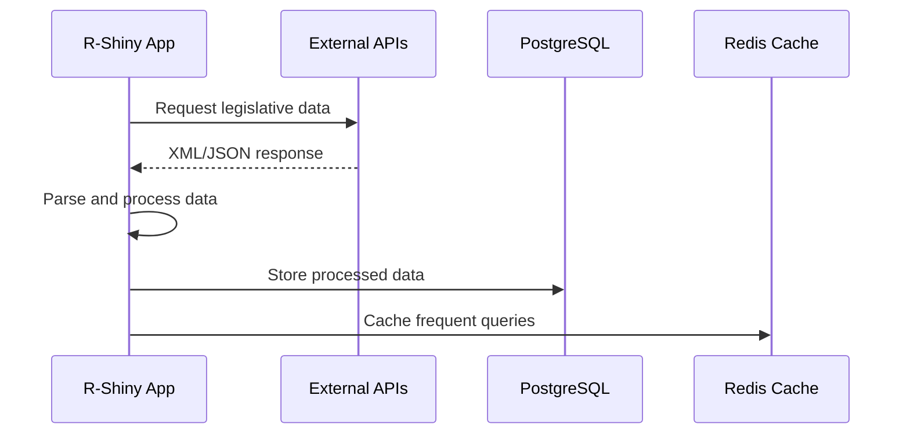
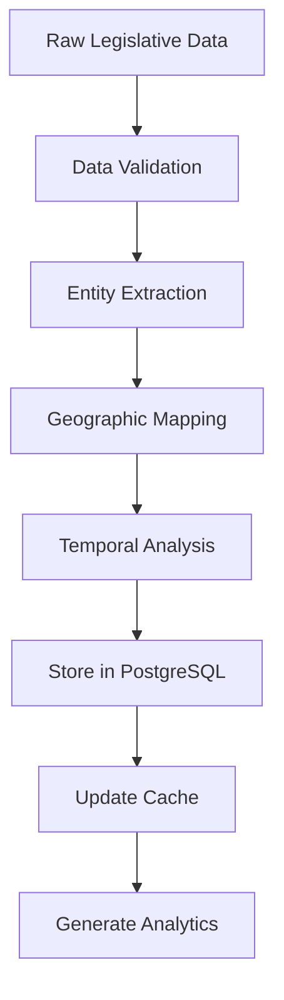

# Arquitetura do Sistema - Monitor Legislativo v4

**Público-alvo**: Desenvolvedores Full-Stack, Arquitetos de Software  
**Última atualização**: 8 de agosto de 2025  
**Versão**: 1.0  
**Status**: Em Desenvolvimento

## Resumo Executivo

Documentação da arquitetura unificada do Monitor Legislativo v4, detalhando a migração de uma arquitetura multi-serviços para um serviço R-Shiny unificado com PostgreSQL e Redis na plataforma Railway.

## Visão Geral da Arquitetura

### Arquitetura Atual (v4 - Unificada)



### Componentes Principais

#### 1. **R-Shiny Application (`app.R`)**
- **Função**: Aplicação principal unificada
- **Tecnologia**: R-Shiny
- **Responsabilidades**:
  - Interface de usuário reativa
  - Lógica de negócio
  - Integração com fontes de dados
  - Geração de relatórios e visualizações

#### 2. **Módulos R (`R/`)**
- **Função**: Componentes modulares do sistema
- **Estrutura**:
  ```
  R/
  ├── api_client.R          # Cliente para APIs externas
  ├── database_connection.R # Conexão com PostgreSQL
  ├── map_generator.R       # Geração de mapas geoespaciais
  ├── export_utils.R        # Utilitários de exportação
  └── auth_system.R         # Sistema de autenticação
  ```

#### 3. **PostgreSQL Database**
- **Função**: Armazenamento principal de dados
- **Esquemas**:
  - `legislative_documents` - Documentos legislativos
  - `geographic_data` - Dados geoespaciais
  - `user_management` - Gestão de usuários
  - `analytics_cache` - Cache de análises

#### 4. **Redis Cache**
- **Função**: Cache de performance
- **Uso**:
  - Cache de consultas frequentes
  - Sessões de usuário
  - Resultados de análises computacionalmente intensivas

## Arquitetura Anterior (v3 - Multi-Serviços) [LEGADO]

### Comparação Arquitetural

| Aspecto | v3 (Multi-Serviços) | v4 (Unificado) |
|---------|---------------------|----------------|
| **Backend** | Python FastAPI | R-Shiny integrado |
| **Frontend** | React/TypeScript | R-Shiny UI |
| **Deployment** | 3 serviços separados | 1 serviço único |
| **Complexidade** | Alta | Baixa |
| **Manutenção** | Complexa | Simplificada |
| **Performance** | Boa | Otimizada |

## Fluxo de Dados

### 1. **Coleta de Dados**


### 2. **Processamento e Análise**


## Decisões Arquiteturais

### 1. **Migração para Arquitetura Unificada**

**Motivação**:
- Redução da complexidade operacional
- Melhor performance através de processamento local
- Simplificação do deployment
- Redução de custos de infraestrutura

**Trade-offs**:
- **Vantagens**: Simplicidade, performance, manutenção
- **Desvantagens**: Menos modularidade, dependência única do R

### 2. **Railway como Plataforma**

**Justificativa**:
- Deployment automático
- Managed PostgreSQL e Redis
- Escalabilidade automática
- Integração com Git

### 3. **PostgreSQL como Database Principal**

**Razões**:
- Suporte robusto a JSON para dados legislativos
- Extensões geoespaciais (PostGIS)
- Performance para consultas complexas
- Conformidade ACID para integridade de dados

## Padrões e Princípios

### 1. **Separation of Concerns**
- Módulos R especializados por função
- Separação clara entre UI e lógica de negócio
- Camada de abstração para acesso a dados

### 2. **Performance First**
- Cache estratégico com Redis
- Lazy loading para grandes datasets
- Processamento assíncrono quando possível

### 3. **Security by Design**
- Sanitização de inputs
- Validação de dados
- Controle de acesso baseado em roles

## Monitoramento e Observabilidade

### Health Checks
- `/health` - Status da aplicação
- Database connectivity checks
- Redis performance metrics
- Memory usage monitoring

### Logging Strategy
- Structured logging with JSON
- Log levels: ERROR, WARN, INFO, DEBUG
- Request/response logging
- Performance metrics

## Escalabilidade e Performance

### Estratégias de Otimização
1. **Database Indexing**: Índices otimizados para consultas frequentes
2. **Query Optimization**: Consultas SQL otimizadas
3. **Caching Strategy**: Cache inteligente com TTL apropriado
4. **Resource Management**: Gestão eficiente de memória R

### Limitações Atuais
- Single-threaded R execution
- Memory constraints para grandes datasets
- Limited horizontal scaling

## Segurança

### Medidas Implementadas
1. **Data Encryption**: Dados em trânsito e em repouso
2. **Input Validation**: Sanitização de inputs do usuário
3. **SQL Injection Prevention**: Prepared statements
4. **Rate Limiting**: Controle de taxa de requisições

### Conformidade
- **LGPD**: Proteção de dados pessoais
- **Academic Standards**: Conformidade com padrões acadêmicos
- **Government Data**: Tratamento adequado de dados públicos

## Planos Futuros

### Roadmap Técnico
1. **Q4 2025**: Implementação de testes automatizados
2. **Q1 2026**: Otimização de performance
3. **Q2 2026**: Implementação de machine learning
4. **Q3 2026**: Expansão para outros domínios legislativos

### Melhorias Planejadas
- **Microservices Migration**: Migração gradual para microserviços quando necessário
- **Real-time Processing**: Processamento em tempo real
- **Advanced Analytics**: Implementação de ML/AI
- **Multi-tenancy**: Suporte a múltiplas instituições

## Referências

### Documentação Relacionada
- [Database Schema](database-schema.md)
- [R Modules Reference](r-modules-reference.md)
- [Integration Architecture](integration-architecture.md)
- [Data Flow Diagrams](data-flow-diagrams.md)

### Recursos Externos
- Railway Documentation
- R-Shiny Architecture Guide
- PostgreSQL Best Practices
- Redis Caching Strategies

---

**Próximas Atualizações Planejadas**:
- Diagramas detalhados de componentes
- Performance benchmarks
- Security audit results
- Scalability analysis

**Responsável pela Documentação**: Equipe de Arquitetura  
**Revisão Técnica**: Pendente  
**Aprovação**: Coordenação Técnica