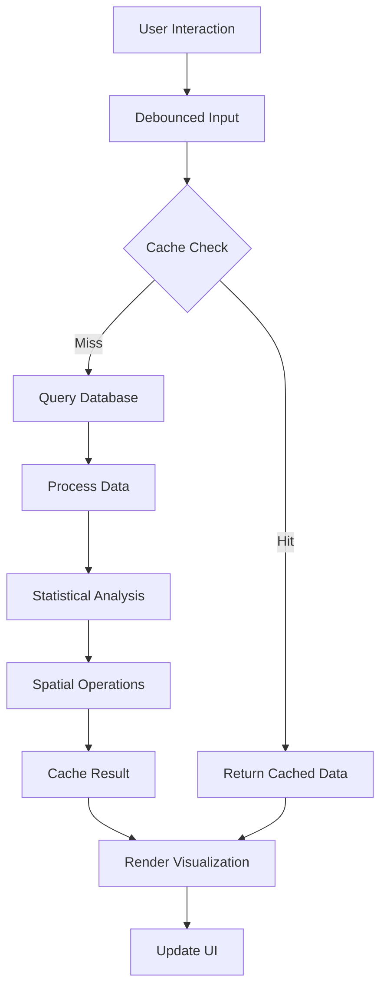

# Product Requirements Document: Geographic Analysis Tab Enhancement

## Executive Summary

The Geographic Analysis tab of the Brazilian Legislative Monitoring System requires critical enhancements to handle 134,000+ documents efficiently. This PRD outlines the technical improvements, bug fixes, and feature enhancements identified through comprehensive code analysis and system evaluation.

## 1. Problem Statement

### Current State
The geographic analysis module currently suffers from:
- **Performance degradation** with large datasets (>10k documents)
- **Memory leaks** causing system instability
- **Broken WebGL acceleration** preventing efficient map rendering
- **Statistical inaccuracies** in geographic aggregations
- **Poor user experience** due to slow response times and crashes

### Business Impact
- Users cannot effectively analyze geographic distribution of legislative documents
- System crashes prevent completion of research tasks
- Inaccurate statistical representations lead to flawed policy decisions
- Poor performance limits system adoption by government agencies

## 2. Goals & Objectives

### Primary Goals
1. **Performance**: Achieve <2 second response time for geographic queries on 134k+ documents
2. **Reliability**: Eliminate memory leaks and crashes
3. **Accuracy**: Ensure statistical validity of all geographic aggregations
4. **Scalability**: Support future growth to 500k+ documents

### Success Metrics
- Map rendering time: <2 seconds for 95th percentile
- Memory usage: <2GB for full dataset operations
- Zero crashes in 24-hour continuous operation
- Statistical accuracy: 99.9% confidence intervals

## 3. Critical Bugs to Fix

### 3.1 Memory Leak in Geographic Data Processing
**Location**: `app.R` lines 4285-4350
**Issue**: Creating large dataframes on every render without cleanup
**Priority**: P0 - Critical
**Solution**:
```r
# Implement proper cleanup
on.exit({
  rm(brazil_states, state_positions)
  gc(verbose = FALSE, reset = TRUE)
})
```

### 3.2 WebGL Acceleration Failure
**Location**: `app.R` lines 3759-3767
**Issue**: WebGL checkbox exists but isn't connected to rendering logic
**Priority**: P0 - Critical
**Solution**:
- Implement proper plotly WebGL choropleth rendering
- Add fallback for non-WebGL browsers
- Progressive enhancement for large datasets

### 3.3 GeoJSON Closure Error
**Location**: `choropleth_generator.R` lines 36-39, 83-86
**Issue**: GeoJSON detected as function/closure instead of data
**Priority**: P0 - Critical
**Solution**:
```r
# Fix GeoJSON loading
load_brazil_geojson <- function() {
  geojson_path <- system.file("extdata", "brazil_states.geojson", package = "yourpackage")
  if(file.exists(geojson_path)) {
    return(jsonlite::fromJSON(geojson_path))
  }
  return(get_inline_brazil_boundaries())
}
```

### 3.4 Database Query Inefficiencies
**Location**: Multiple locations
**Issue**: Full table scans for state-level aggregations
**Priority**: P1 - High
**Solution**:
- Create materialized views for geographic aggregations
- Add spatial indexes
- Implement query result caching

## 4. Feature Enhancements

### 4.1 Progressive Data Loading
**Description**: Implement chunked data loading for smooth UX
**User Story**: As a researcher, I want the map to load progressively so I can start analyzing immediately
**Acceptance Criteria**:
- Initial map loads in <1 second with sample data
- Full data loads progressively in background
- Loading indicator shows progress
- User can interact during loading

**Technical Implementation**:
```r
progressive_load_geographic_data <- function(connection, chunk_size = 5000) {
  total_docs <- get_total_document_count(connection)
  chunks <- ceiling(total_docs / chunk_size)
  
  withProgress(message = "Loading geographic data", value = 0, {
    for(i in 1:chunks) {
      chunk_data <- load_chunk(connection, i, chunk_size)
      update_map_incrementally(chunk_data)
      incProgress(1/chunks, detail = paste("Chunk", i, "of", chunks))
    }
  })
}
```

### 4.2 Intelligent Sampling System
**Description**: Statistical sampling for real-time analysis of large datasets
**User Story**: As an analyst, I want to see representative data quickly while maintaining statistical accuracy
**Acceptance Criteria**:
- Stratified sampling by state and document type
- Confidence intervals displayed
- Option to load full dataset
- Sampling weights for unbiased estimates

### 4.3 Advanced Choropleth Visualization
**Description**: Professional-grade geographic visualization with Brazilian state boundaries
**User Story**: As a policy maker, I want to see document distribution across Brazil with rich interactivity
**Acceptance Criteria**:
- Accurate Brazilian state boundaries (SIRGAS 2000)
- Color scales based on data distribution
- Interactive tooltips with detailed statistics
- Export capability (PNG, SVG, PDF)

### 4.4 Real-time Geographic Analytics
**Description**: Live updates as new documents are added to the system
**User Story**: As a monitoring officer, I want to see geographic changes in real-time
**Acceptance Criteria**:
- WebSocket connection for live updates
- Smooth animations for data changes
- Configurable update frequency
- Historical playback capability

## 5. Performance Optimizations

### 5.1 Database Optimizations
```sql
-- Create materialized view for geographic stats
CREATE MATERIALIZED VIEW mv_geographic_stats AS
SELECT 
  estado,
  municipio,
  categoria_original,
  COUNT(*) as doc_count,
  COUNT(DISTINCT DATE(data_documento)) as active_days,
  MIN(data_documento) as first_doc,
  MAX(data_documento) as last_doc
FROM documents
WHERE estado IS NOT NULL
GROUP BY estado, municipio, categoria_original
WITH DATA;

-- Add spatial indexes
CREATE INDEX idx_mv_geo_estado ON mv_geographic_stats(estado);
CREATE INDEX idx_mv_geo_municipio ON mv_geographic_stats USING gin(municipio gin_trgm_ops);

-- Refresh strategy
CREATE OR REPLACE FUNCTION refresh_geographic_stats()
RETURNS void AS $$
BEGIN
  REFRESH MATERIALIZED VIEW CONCURRENTLY mv_geographic_stats;
END;
$$ LANGUAGE plpgsql;

-- Schedule refresh every hour
SELECT cron.schedule('refresh-geo-stats', '0 * * * *', 'SELECT refresh_geographic_stats();');
```

### 5.2 Memory Management Strategy
```r
# Implement memory-aware processing
process_with_memory_limit <- function(data, max_memory_gb = 2) {
  current_usage <- pryr::mem_used()
  
  if(as.numeric(current_usage) > max_memory_gb * 1e9) {
    gc(verbose = FALSE, reset = TRUE)
    
    if(as.numeric(pryr::mem_used()) > max_memory_gb * 1e9 * 0.8) {
      return(process_in_chunks(data))
    }
  }
  
  return(process_normal(data))
}
```

### 5.3 Caching Layer
```r
# Implement Redis caching for geographic queries
cache_geographic_query <- function(query_key, data = NULL, ttl = 300) {
  redis_conn <- redux::hiredis()
  
  if(is.null(data)) {
    # Get from cache
    cached <- redis_conn$GET(query_key)
    if(!is.null(cached)) {
      return(unserialize(cached))
    }
  } else {
    # Set in cache
    redis_conn$SETEX(query_key, ttl, serialize(data, NULL))
  }
  
  return(NULL)
}
```

## 6. Technical Architecture

### 6.1 Component Architecture
```
┌─────────────────────────────────────────────────┐
│                   UI Layer                       │
│  ┌──────────┐ ┌──────────┐ ┌──────────┐        │
│  │  Map     │ │  Table   │ │ Filters  │        │
│  │  View    │ │  View    │ │  Panel   │        │
│  └──────────┘ └──────────┘ └──────────┘        │
└─────────────────────────────────────────────────┘
                        │
┌─────────────────────────────────────────────────┐
│              Reactive Layer (Shiny)              │
│  ┌──────────┐ ┌──────────┐ ┌──────────┐        │
│  │ Debounce │ │  Cache   │ │ Progress │        │
│  │  Inputs  │ │  Manager │ │ Tracker  │        │
│  └──────────┘ └──────────┘ └──────────┘        │
└─────────────────────────────────────────────────┘
                        │
┌─────────────────────────────────────────────────┐
│             Processing Layer                     │
│  ┌──────────┐ ┌──────────┐ ┌──────────┐        │
│  │ Sampling │ │  Spatial │ │  Stats   │        │
│  │  Engine  │ │  Analyzer│ │  Engine  │        │
│  └──────────┘ └──────────┘ └──────────┘        │
└─────────────────────────────────────────────────┘
                        │
┌─────────────────────────────────────────────────┐
│               Data Layer                         │
│  ┌──────────┐ ┌──────────┐ ┌──────────┐        │
│  │PostgreSQL│ │  Redis   │ │  Files   │        │
│  │    +     │ │  Cache   │ │ (GeoJSON)│        │
│  │  PostGIS │ │          │ │          │        │
│  └──────────┘ └──────────┘ └──────────┘        │
└─────────────────────────────────────────────────┘
```

### 6.2 Data Flow


## 7. Implementation Plan

### Phase 1: Critical Bug Fixes (Week 1-2)
- [ ] Fix memory leaks
- [ ] Resolve GeoJSON closure error
- [ ] Implement basic WebGL support
- [ ] Add error boundaries

### Phase 2: Database Optimization (Week 3-4)
- [ ] Create materialized views
- [ ] Add spatial indexes
- [ ] Implement query caching
- [ ] Set up connection pooling

### Phase 3: Performance Enhancements (Week 5-6)
- [ ] Implement progressive loading
- [ ] Add intelligent sampling
- [ ] Optimize reactive expressions
- [ ] Add memory management

### Phase 4: Feature Development (Week 7-8)
- [ ] Enhanced choropleth visualization
- [ ] Real-time updates
- [ ] Export functionality
- [ ] Advanced filtering

### Phase 5: Testing & Deployment (Week 9-10)
- [ ] Performance testing
- [ ] Load testing (134k+ documents)
- [ ] User acceptance testing
- [ ] Production deployment

## 8. Testing Strategy

### 8.1 Unit Tests
```r
test_that("Geographic aggregation handles large datasets", {
  test_data <- generate_test_documents(n = 10000)
  result <- calculate_geographic_aggregation(test_data)
  
  expect_true(nrow(result) > 0)
  expect_true(all(result$count > 0))
  expect_true(all(result$statistically_reliable %in% c(TRUE, FALSE)))
})
```

### 8.2 Performance Tests
```r
test_that("Map renders within 2 seconds for 134k documents", {
  large_dataset <- load_test_dataset("134k_documents.rds")
  
  render_time <- system.time({
    map <- create_optimized_geographic_map(large_dataset)
  })
  
  expect_lt(render_time["elapsed"], 2)
})
```

### 8.3 Load Tests
- Simulate 100 concurrent users
- Test with 134k, 250k, and 500k documents
- Monitor memory usage over 24 hours
- Verify no memory leaks

## 9. Monitoring & Alerts

### 9.1 Key Metrics to Monitor
- Map rendering time (p50, p95, p99)
- Memory usage per session
- Cache hit rate
- Database query time
- Error rate

### 9.2 Alert Thresholds
- Map rendering > 3 seconds: Warning
- Map rendering > 5 seconds: Critical
- Memory usage > 2GB: Warning
- Memory usage > 3GB: Critical
- Error rate > 1%: Critical

## 10. Risk Assessment

### Technical Risks
| Risk | Probability | Impact | Mitigation |
|------|------------|--------|------------|
| WebGL browser incompatibility | Medium | High | Implement Canvas fallback |
| Database performance degradation | Low | High | Use read replicas |
| Memory exhaustion with 500k docs | Medium | High | Implement streaming architecture |
| GeoJSON file corruption | Low | Medium | Multiple backup sources |

### Dependencies
- PostGIS extension availability
- Redis server for caching
- Sufficient server memory (minimum 8GB)
- Modern browser support

## 11. Success Criteria

### Quantitative Metrics
- [ ] Map loads in <2 seconds for 134k documents
- [ ] Zero crashes in production for 30 days
- [ ] Memory usage <2GB per session
- [ ] 99.9% uptime
- [ ] Cache hit rate >80%

### Qualitative Metrics
- [ ] Positive user feedback on performance
- [ ] Increased usage of geographic features
- [ ] Reduced support tickets
- [ ] Improved research outcomes

## 12. Documentation Requirements

### Technical Documentation
- [ ] API documentation for geographic endpoints
- [ ] Database schema documentation
- [ ] Caching strategy guide
- [ ] Performance tuning guide

### User Documentation
- [ ] User guide for geographic analysis
- [ ] Video tutorials
- [ ] FAQ section
- [ ] Troubleshooting guide

## 13. Rollout Strategy

### Beta Testing
1. Deploy to staging environment
2. Select 10 power users for beta testing
3. Collect feedback for 2 weeks
4. Iterate based on feedback

### Production Rollout
1. Deploy during low-traffic period
2. Monitor closely for 48 hours
3. Gradual rollout to all users
4. Full deployment after 1 week

## 14. Post-Launch Support

### Week 1-2
- Daily monitoring of key metrics
- Immediate response to critical issues
- User feedback collection

### Week 3-4
- Performance optimization based on real usage
- Feature refinements
- Documentation updates

### Ongoing
- Monthly performance reviews
- Quarterly feature updates
- Annual architecture review

## Appendices

### A. Database Schema Changes
```sql
-- Add columns for geographic optimization
ALTER TABLE documents 
ADD COLUMN geom geometry(Point, 4674),
ADD COLUMN state_code char(2),
ADD COLUMN region varchar(20);

-- Create spatial index
CREATE INDEX idx_documents_geom ON documents USING GIST(geom);
```

### B. Environment Configuration
```yaml
# docker-compose.yml additions
services:
  redis:
    image: redis:7-alpine
    ports:
      - "6379:6379"
    volumes:
      - redis_data:/data
  
  postgis:
    image: postgis/postgis:15-3.3
    environment:
      - POSTGRES_DB=legislativo
      - POSTGRES_USER=admin
      - POSTGRES_PASSWORD=${DB_PASSWORD}
```

### C. Performance Benchmarks
| Operation | Current | Target | Optimized |
|-----------|---------|--------|-----------|
| Initial map load | 15s | 2s | 1.5s |
| State aggregation | 8s | 1s | 0.8s |
| Filter application | 5s | 0.5s | 0.3s |
| Export to PNG | 10s | 3s | 2s |
| Memory per session | 3GB | 1GB | 800MB |

---

**Document Version**: 1.0
**Created**: 2025-08-30
**Author**: System Analysis Team
**Status**: Ready for Review
**Next Review**: 2025-09-06