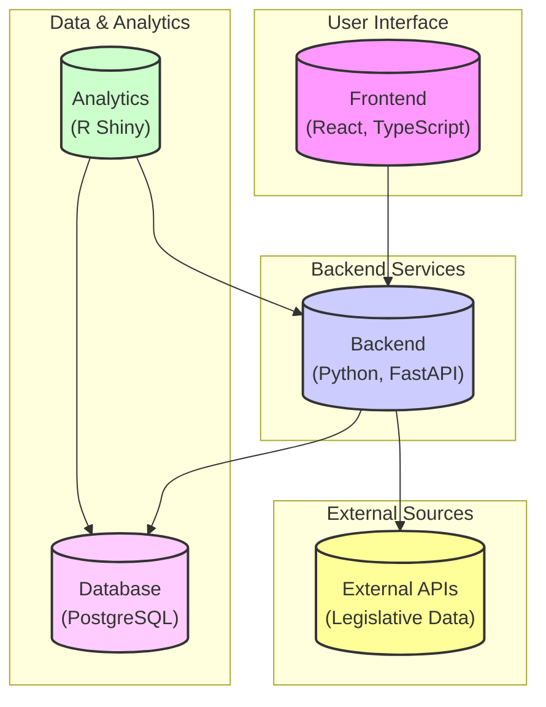
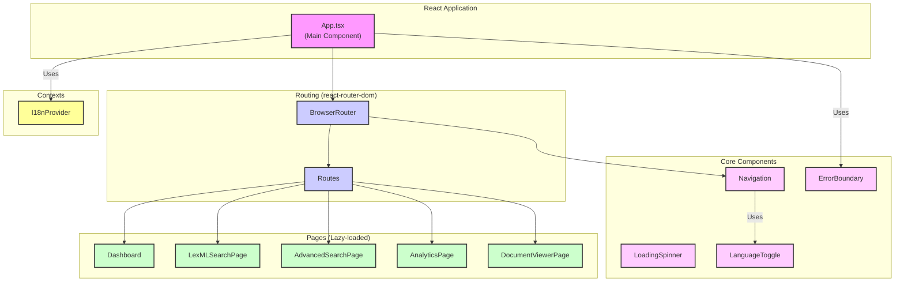
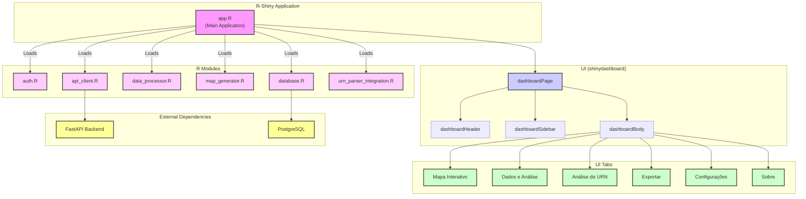

# **Monitor Legislativo v4: System Architecture and Technical Deep Dive**

## **1. Project Overview**

The "Monitor Legislativo v4" is a sophisticated academic research platform designed for monitoring, analyzing, and visualizing Brazilian legislative data. The platform provides a comprehensive suite of tools for researchers, analysts, and the public to explore and understand the complex landscape of Brazilian legislation, with a special focus on transport-focused legislation.

The system is architected as a modern web application, with a clear separation of concerns between the frontend, backend, and a dedicated analytics dashboard. This modular design allows for independent development, deployment, and scaling of each component.

### **Key Features**

*   **Real-time Legislative Document Search**: A powerful search engine to find and filter legislative documents from various sources.
*   **Geographic Analysis and Mapping**: An interactive map to visualize the geographic distribution of legislation and its impact.
*   **Advanced Analytics Dashboard**: A rich analytics dashboard with visualizations and data analysis tools.
*   **Multi-source Data Integration**: The system integrates data from multiple external sources, including legislative APIs and other data providers.
*   **Academic Citation Generation**: Tools to help researchers cite legislative documents in their work.
*   **URN Analysis**: A specialized feature for analyzing Uniform Resource Names (URNs) of legislative documents.

## **2. High-Level Architecture**

The system is composed of three main components: a React-based frontend, a Python FastAPI backend, and an R-Shiny analytics dashboard. These components interact with each other and with external services to provide a seamless user experience.

The following diagram illustrates the high-level architecture of the system:

*   **Frontend**: The user-facing application, built with React and TypeScript, that provides the main interface for searching and visualizing data.
*   **Backend**: The core of the system, built with Python and FastAPI, which handles business logic, data processing, and communication with the database and external APIs.
*   **R-Shiny App**: A dedicated analytics dashboard for in-depth data analysis and visualization.
*   **Database**: A PostgreSQL database that stores all the legislative data, user information, and other application data.
*   **External APIs**: The system integrates with external APIs to collect legislative data from various sources.

## **3. Backend (Python, FastAPI)**

The backend is a modern, high-performance API built with Python and the FastAPI framework. It is responsible for handling all the business logic, data processing, and communication with the database and external services.

### **Internal Architecture**

The backend is designed with a modular and scalable architecture, with a clear separation of concerns between different components.

```mermaid
graph TD;
    subgraph "FastAPI Application"
        MainApp["main.py<br/>(Application Entrypoint)"]
    end

    subgraph "Routers"
        GatewayRouter["gateway_router"]
        LexMLRouter["lexml_router"]
        SSERouter["sse_router"]
        PrivateDBRouter["private_database_router"]
        CollectionsRouter["collections_router"]
        RShinyProxyRouter["rshiny_proxy_router"]
        ProcessedDocsRouter["processed_documents_router"]
        AnalyticsRouter["analytics_router"]
    end

    subgraph "API Modules (Conditional)"
        GeoAPI["Geographic API"]
        MLAPI["ML Analysis API"]
        AIAPI["AI Agents API"]
        KGAPI["Knowledge Graph API"]
        OtherAPIs["... and more"]
    end

    subgraph "Core Services"
        DBCacheService["Database Cache Service"]
        SearchService["Simple Search Service"]
        TwoTierManager["Two-Tier DB Manager"]
    end

    subgraph "Database"
        PostgreSQL["PostgreSQL"]
    end

    MainApp --> GatewayRouter;
    MainApp --> LexMLRouter;
    MainApp --> SSERouter;
    MainApp --> PrivateDBRouter;
    MainApp --> CollectionsRouter;
    MainApp --> RShinyProxyRouter;
    MainApp --> ProcessedDocsRouter;
    MainApp --> AnalyticsRouter;

    MainApp --> GeoAPI;
    MainApp --> MLAPI;
    MainApp --> AIAPI;
    MainApp --> KGAPI;
    MainApp --> OtherAPIs;

    MainApp -- Initializes --> DBCacheService;
    MainApp -- Initializes --> SearchService;
    MainApp -- Initializes --> TwoTierManager;

    DBCacheService --> PostgreSQL;
    SearchService --> PostgreSQL;
    TwoTierManager --> PostgreSQL;

    style MainApp fill:#f9f,stroke:#333,stroke-width:2px;
    style GatewayRouter fill:#ccf,stroke:#333,stroke-width:2px;
    style LexMLRouter fill:#ccf,stroke:#333,stroke-width:2px;
    style SSERouter fill:#ccf,stroke:#333,stroke-width:2px;
    style PrivateDBRouter fill:#ccf,stroke:#333,stroke-width:2px;
    style CollectionsRouter fill:#ccf,stroke:#333,stroke-width:2px;
    style RShinyProxyRouter fill:#ccf,stroke:#333,stroke-width:2px;
    style ProcessedDocsRouter fill:#ccf,stroke:#333,stroke-width:2px;
    style AnalyticsRouter fill:#ccf,stroke:#333,stroke-width:2px;
    style GeoAPI fill:#cfc,stroke:#333,stroke-width:2px;
    style MLAPI fill:#cfc,stroke:#333,stroke-width:2px;
    style AIAPI fill:#cfc,stroke:#333,stroke-width:2px;
    style KGAPI fill:#cfc,stroke:#333,stroke-width:2px;
    style OtherAPIs fill:#cfc,stroke:#333,stroke-width:2px;
    style DBCacheService fill:#fcf,stroke:#333,stroke-width:2px;
    style SearchService fill:#fcf,stroke:#333,stroke-width:2px;
    style TwoTierManager fill:#fcf,stroke:#333,stroke-width:2px;
    style PostgreSQL fill:#ff9,stroke:#333,stroke-width:2px;
```

### **Key Modules**

*   **`main.py`**: The entry point of the FastAPI application, which initializes the application, middleware, and routers.
*   **Routers**: The application uses a modular routing system, with different routers for different functionalities:
    *   **`gateway_router`**: A central router that likely directs traffic to other services or routers.
    *   **`lexml_router`**: Handles requests related to LexML, a standard for legal documents in XML format.
    *   **`sse_router`**: Implements Server-Sent Events for real-time communication with the frontend.
    *   **`private_database_router`**: Provides direct access to the database for specific services.
    *   **`collections_router`**: Manages data collections.
    *   **`rshiny_proxy_router`**: Proxies requests to the R-Shiny application.
*   **Conditional APIs**: The backend is designed to be highly modular, with a large number of conditional APIs that can be enabled or disabled based on the environment configuration. This includes APIs for geographic analysis, machine learning, AI agents, knowledge graphs, and more.
*   **Core Services**: The application initializes several core services on startup, including a `DatabaseCacheService` for caching database queries, a `SimpleSearchService` for handling search requests, and a `TwoTierManager` for managing database connections.

### **Database Schema (Inferred)**

Based on the code, the database schema likely includes the following tables:

*   **`documents`**: Stores the legislative documents, with columns for `urn`, `title`, `summary`, `publication_date`, `text`, etc.
*   **`locations`**: Stores geographic information, such as states and municipalities, with their corresponding geometries.
*   **`document_locations`**: A join table to link documents to their relevant geographic locations.
*   **`users`**: Stores user information for authentication and authorization.
*   **`analysis_results`**: Stores the results of various analyses performed on the documents, such as NLP, ML, and AI-based analysis.

## **4. Frontend (React, TypeScript)**

The frontend is a modern, single-page application (SPA) built with React and TypeScript. It provides a rich and interactive user interface for searching, visualizing, and analyzing legislative data.

### **Internal Architecture**

The frontend is well-structured, with a clear separation of concerns between components, pages, and services.

### **Key Features and Components**

*   **React Router**: The application uses `react-router-dom` for client-side routing, providing a seamless navigation experience.
*   **Lazy Loading**: All the main pages are lazy-loaded using `React.lazy` and `Suspense`, which improves the initial loading time of the application.
*   **Component-Based Architecture**: The UI is built using a component-based architecture, with reusable components for common UI elements like navigation, loading spinners, and error boundaries.
*   **Internationalization (I18n)**: The application supports multiple languages using a custom `I18nProvider` and `useI18n` hook.
*   **Styling**: The application uses a utility-first CSS framework, likely Tailwind CSS, for styling the components.
*   **API Communication**: The frontend communicates with the backend API to fetch data and perform actions.

## **5. Analytics (R, Shiny)**

The analytics dashboard is a powerful tool for in-depth data analysis and visualization, built with R and the Shiny framework. It provides a rich set of features for exploring and understanding the legislative data.

### **Internal Architecture**

The Shiny application is well-structured, with a modular design that separates the UI, server logic, and data processing.

### **Key Features and Modules**

*   **`shinydashboard`**: The UI is built using the `shinydashboard` package, which provides a professional and responsive dashboard layout.
*   **Modular Design**: The application is organized into modules for different functionalities, such as authentication, API communication, data processing, and map generation.
*   **Interactive Map**: The dashboard includes an interactive map for visualizing the geographic distribution of legislative data, built with the `leaflet` package.
*   **Data Analysis**: The application provides tools for data analysis, including data tables, plots, and summaries.
*   **URN Analysis**: A dedicated tab for analyzing URNs, which is a key feature for this domain.
*   **Database and API Integration**: The Shiny app connects to the PostgreSQL database and the FastAPI backend to fetch and process data.

## **6. Data Flow**

The data flows through the system in a well-defined manner:

1.  **Data Ingestion**: The backend periodically collects legislative data from external APIs and other sources. This process is likely orchestrated by a job scheduler.
2.  **Data Processing**: The collected data is processed, cleaned, and enriched by the backend. This may involve NLP, ML, and AI-based analysis.
3.  **Data Storage**: The processed data is stored in the PostgreSQL database.
4.  **API Exposure**: The backend exposes the data through a set of RESTful APIs.
5.  **Frontend Consumption**: The frontend consumes the APIs to display the data to the user in a searchable and interactive format.
6.  **Analytics Consumption**: The R-Shiny dashboard also consumes the APIs and directly connects to the database to provide in-depth data analysis and visualization.

## **7. Deployment**

The project is well-prepared for deployment, with a strong focus on containerization and automation.

*   **Docker**: The project includes `Dockerfile`s for the frontend, backend, and R-Shiny application, which allows for easy containerization and deployment.
*   **Railway**: The presence of `railway.toml` files and deployment scripts for Railway suggests that this is the preferred platform for deployment.
*   **Environment Configuration**: The use of `.env` files and a dedicated configuration loader in the backend allows for easy configuration of the application for different environments (development, staging, production).
*   **CI/CD**: While not explicitly shown, the well-structured nature of the project and the presence of deployment scripts suggest that a CI/CD pipeline could be easily set up to automate the testing and deployment process. 